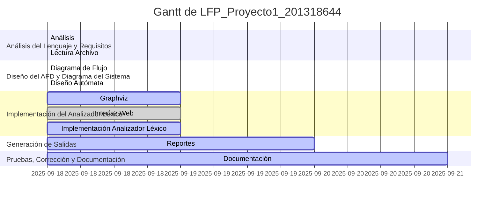

```mermaid
gantt
    dateFormat  YYYY-MM-DD
    title Gantt de LFP_Proyecto1_201318644
    excludes    weekends
    section Análisis del Lenguaje y Requisitos
    Análisis :done, 2, 2025-09-18, 2025-09-18
    Lectura Archivo :done, 1, 2025-09-18, 2025-09-18
    section Diseño del AFD y Diagrama del Sistema
    Diagrama de Flujo :active, 4, 2025-09-18, 2025-09-18
    Diseño Autómata :active, 3, 2025-09-18, 2025-09-18
    section Implementación del Analizador Léxico
    Graphviz :active, 7, 2025-09-18, 2025-09-19
    Interfaz Web :done, 6, 2025-09-18, 2025-09-19
    Implementación Analizador Léxico :active, 5, 2025-09-18, 2025-09-19
    section Generación de Salidas
    Reportes :active, 8, 2025-09-18, 2025-09-20
    section Pruebas, Corrección y Documentación
    Documentación :active, 9, 2025-09-18, 2025-09-21
```